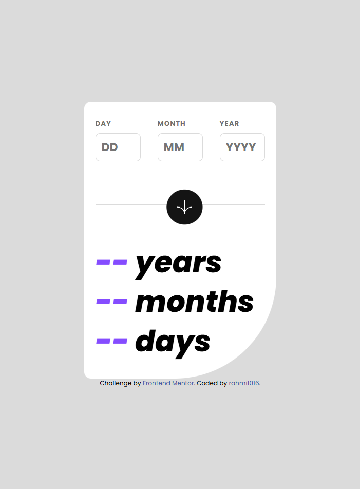

# Frontend Mentor - Age calculator app solution

This is a solution to the [Age calculator app challenge on Frontend Mentor](https://www.frontendmentor.io/challenges/age-calculator-app-dF9DFFpj-Q). Frontend Mentor challenges help you improve your coding skills by building realistic projects.

## Table of contents

- [Overview](#overview)
  - [The challenge](#the-challenge)
  - [Screenshot](#screenshot)
  - [Links](#links)
- [My process](#my-process)
  - [Built with](#built-with)
  - [What I learned](#what-i-learned)
  - [Continued development](#continued-development)
  - [Useful resources](#useful-resources)
- [Author](#author)
- [Acknowledgments](#acknowledgments)

**Note: Delete this note and update the table of contents based on what sections you keep.**

## Overview

### The challenge

Users should be able to:

- View an age in years, months, and days after submitting a valid date through the form
- Receive validation errors if:
  - Any field is empty when the form is submitted
  - The day number is not between 1-31
  - The month number is not between 1-12
  - The year is in the future
  - The date is invalid e.g. 31/04/1991 (there are 30 days in April)
- View the optimal layout for the interface depending on their device's screen size
- See hover and focus states for all interactive elements on the page
- **Bonus**: See the age numbers animate to their final number when the form is submitted

### Screenshot

### Links

- Solution URL: [solution](https://github.com/rahmi1016/fmage-calculator-app-main2/tree/main)
- Live Site URL: [live site url](https://rahmi1016.github.io/fmage-calculator-app-main2/)

## My process

### Built with

- Semantic HTML5 markup
- CSS custom properties

### What I learned

Through this project, I get more understanding about z-index application.

### Continued development

After I understand how to upload react project to github, I will focus using reacts and tailwinds

### Useful resources

- [Age Calculator using JavaScript](https://github.com/sujitmahapatra/Age-Calculator-using-JS/tree/main) - This helped me for understanding using javascript to calculate age with current day.

## Author

- Frontend Mentor - [@rahmi1016](https://www.frontendmentor.io/profile/rahmi1016)

## Acknowledgments

- [sujitmahapatra](https://github.com/sujitmahapatra)
